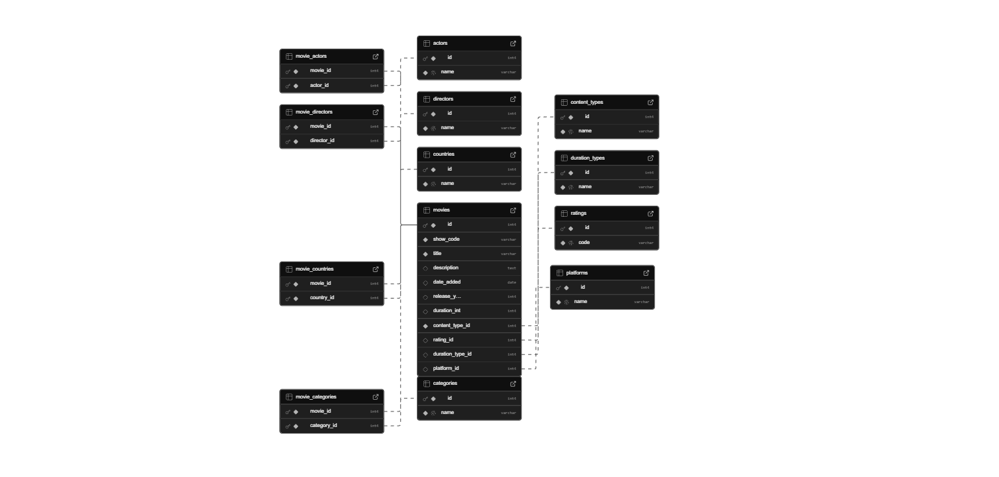

# Rocking Challenge

Este repositorio automatiza la descarga de los catálogos de Disney+ y Netflix, el análisis exploratorio (EDA), la normalización del dataset y la carga en una base PostgreSQL/Supabase. A continuación se describe el flujo completo.

---

## 1. Preparar el entorno

```bash
# Crear el entorno virtual (una sola vez)
python -m venv .venv

# Activar
# - Windows PowerShell
.venv\Scripts\Activate.ps1
# - macOS / Linux
source .venv/bin/activate

# Instalar dependencias
pip install --upgrade pip
pip install -r requirements.txt
```

## 2. Descargar los CSV fuente

Las URL se definen en `.env` (`DISNEY_URL`, `NETFLIX_URL`). El script `functions/get_by_url.py` incluye `download_csv_from_url`, que puedes ejecutar desde consola:

```bash
# Cargar variables desde .env (PowerShell)
Get-Content .env | ForEach-Object {
    if ($_ -match '^\s*([^=]+)=(.+)$') {
        Set-Item -Path env:$($Matches[1]) -Value $Matches[2].Trim('"')
    }
}

python - <<'PY'
from functions.get_by_url import download_csv_from_url
import os

target = "data/downloads"
download_csv_from_url(os.environ["DISNEY_URL"], dest_path=target)
download_csv_from_url(os.environ["NETFLIX_URL"], dest_path=target)
PY
```

También puedes ejecutar `python functions/get_by_url.py` para probar con la URL de ejemplo incluida en el script.

## 3. EDA y dataset combinado

1. Abre `eda.ipynb` (por ejemplo con VS Code o Jupyter) para explorar los datos, limpiar valores problemáticos y generar `data/raw/combined.csv`.
2. Asegúrate de que ese CSV sea el que quieras cargar en la base.

## 4. Crear las tablas

El comando preferido usa SQLAlchemy y la cadena `DB_URI` del `.env` (se adjuntan credenciales en el correo de entrega):

```bash
# Si necesitas recrear todo desde cero
$env:DROP_EXISTING = "true"   # PowerShell
# export DROP_EXISTING=true   # macOS / Linux

python -m db.init_db
```

Alternativas:

- `db/queries/ddl/create_tables_postgres.sql`: DDL completo para PostgreSQL/Supabase.
- `sql_queries/ddl/create_tables.sql`: DDL equivalente para SQL Server (por compatibilidad).

## 5. Poblar la base

Con `data/raw/combined.csv` listo:

```bash
python -m db.populate_db
```

El script:
- Reutiliza dimensiones existentes (no duplica `Movie`, `TV Show`, etc.).
- Inserta las películas y arma las relaciones N:N (directores, actores, países, categorías).

## 6. Consultas y stored procedure (PostgreSQL)

- `db/queries/desafio/actor_mas_peliculas.sql`: actor con más participaciones en Netflix.
- `db/queries/desafio/top10_actores_anio_act.sql`: top 10 actores del año actual para Netflix + Disney+.
- `db/queries/stored_procedures/sp_get_top5_pelis_largas.sql`: stored procedure (`CALL public.sp_get_top5_pelis_largas(2024, 'cursor_name'); FETCH ALL FROM cursor_name;`) que devuelve las 5 películas más largas en minutos (valida que la unidad sea “min”).

## 7. Esquema de la base



La imagen detalla la tercera forma normal: `movies` como tabla central, dimensiones (`content_types`, `ratings`, `duration_types`, `platforms`) y tablas puente (`movie_directors`, `movie_actors`, `movie_countries`, `movie_categories`).

---

Con estos pasos puedes recrear la base en tu entorno local o en Supabase, ejecutar el EDA y responder las consultas pedidas usando los scripts ya disponibles. Cualquier ampliación (nuevos reportes, más plataformas) puede encadenarse reutilizando los módulos de `db/` y `functions/`.
